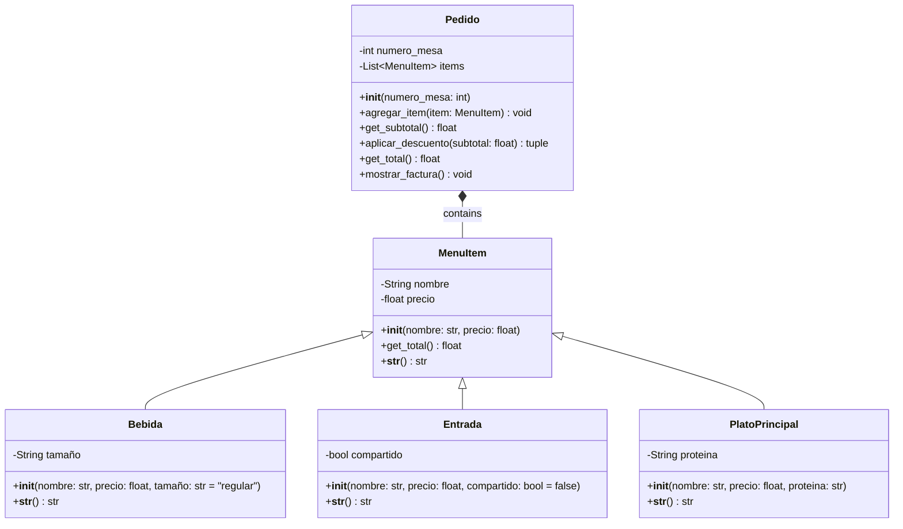

# RETO-03

En este repositorio se encontrara el reto 3 de la clase de POO 

---

## Ejercicio de clase (`ejercico_clase.py`)

`length`, `slope`, `start`, `end`: Atributos de instancia, dos de los cuales son puntos (por lo que una línea se compone al menos de dos puntos).
`compute_length()`: debe devolver la longitud de la línea.
`compute_slope()`: debe devolver la pendiente de la línea desde la horizontal en grados.
`compute_horizontal_cross()`: debe devolver si existe la intersección con el eje x.
`compute_vertical_cross()`: debe devolver si existe la intersección con el eje y.
Redefinir la clase Rectangle, añadiendo un nuevo método de inicialización usando 4 líneas (composición óptima: un rectángulo se compone de 4 líneas).

### Código completo

```python
class Point:
    def __init__(self, x: float, y: float) -> None:
        self.x = x
        self.y = y

class Line(Point):
    def __init__(self, start: Point, end: Point ) -> None:
        super().__init__(start.x, start.y)
        self.start = start
        self.end = end

    def compute_length(self) -> float:
        length = ((self.end.x - self.start.x) ** 2 + (self.end.y - self.start.y) ** 2) ** 0.5
        return length
    
    def compute_slope(self):
        # Vertical line
        if (self.end.x - self.start.x) == 0:
            return None  
        slope: float = (self.end.y - self.start.y) / (self.end.x - self.start.x)
        return slope
    
    def compute_vertical_crossing(self):
        # Intersection with y-axis (x=0)
        slope = self.compute_slope()
        if slope is None:
            return None
        crossing = self.start.y - (slope * self.start.x)  # y = mx + b  =>  b = y - mx
        return crossing

    def compute_horizontal_crossing(self):
        # Intersection with x-axis (y=0)
        slope = self.compute_slope()
        if slope == 0:
            return None  # Horizontal line has no crossing with x-axis
        if slope is None:
            return None  # Vertical line has no crossing with x-axis
        crossing = -(self.start.y - (slope * self.start.x)) / slope  # y = mx + b  =>  x = (y - b) / m
        return crossing
    
    def __str__(self) -> str:
        slope = self.compute_slope()
        slope_str = f"{slope:.2f}"
        v_cross = self.compute_vertical_crossing()
        h_cross = self.compute_horizontal_crossing()
        return (
            f"Length: {self.compute_length():.2f}, "
            f"Slope: {slope_str}, "
            f"Vertical crossing: {v_cross}, "
            f"Horizontal crossing: {h_cross}"
        )

class Rectangle:
    def __init__(self, method: int, *args):
        if method == 1:
            # Method 1: Bottom-left + width + height
            bottom_left, width, height = args
            self.width = width
            self.height = height
            self.center = Point(bottom_left.x + width/2, bottom_left.y + height/2)

        elif method == 2:
            # Method 2: Center + width + height
            center, width, height = args
            self.width = width
            self.height = height
            self.center = center

        elif method == 3:
            # Method 3: Two opposite points
            p1, p2 = args
            self.width = abs(p2.x - p1.x)
            self.height = abs(p2.y - p1.y)
            self.center = Point((p1.x + p2.x)/2, (p1.y + p2.y)/2)

        elif method == 4:
            # Method 4: Four lines (composition)
            l1, l2, l3, l4 = args
            lines = [l1, l2, l3, l4]

            points = []
            for line in lines:
                points.append(line.start)
                points.append(line.end)

            xs = []
            ys = []
            for p in points:
                xs.append(p.x)
                ys.append(p.y)

            min_x = min(xs)
            max_x = max(xs)
            min_y = min(ys)
            max_y = max(ys)

            self.width = max_x - min_x
            self.height = max_y - min_y
            self.center = Point((min_x + max_x) / 2, (min_y + max_y) / 2)

        else:
            return "Error: Invalid method"

    def compute_area(self):
        return self.width * self.height

    def compute_perimeter(self):
        return 2 * (self.width + self.height)

    def compute_interference_point(self, point: Point) -> bool:
        x_min = self.center.x - self.width/2
        x_max = self.center.x + self.width/2
        y_min = self.center.y - self.height/2
        y_max = self.center.y + self.height/2
        return x_min <= point.x <= x_max and y_min <= point.y <= y_max


class Square(Rectangle):
    def __init__(self, method: int, *args):
        if method == 1:
            # Method 1: Bottom-left + side
            bottom_left, side = args
            super().__init__(1, bottom_left, side, side)
        elif method == 2:
            # Method 2: Center + side
            center, side = args
            super().__init__(2, center, side, side)
        elif method == 3:
            # Method 3: Two opposite points
            p1, p2 = args
            side = max(abs(p2.x - p1.x), abs(p2.y - p1.y))
            super().__init__(2, Point((p1.x + p2.x) / 2, (p1.y + p2.y) / 2), side, side)
        else:
            raise ValueError("Error: Invalid method")
```
### PUNTO 2 (`Reto 03.py`)

### Enunciado

Escenario de restaurante: Se desea diseñar un programa para calcular la cuenta del pedido de un cliente.
Defina la clase base `MenuItem`: Esta clase debe tener atributos como nombre, precio y un método para calcular el precio total.
Cree subclases para diferentes tipos de elementos del menú: Herede de `MenuItem` y defina propiedades específicas para cada tipo (por ejemplo, `Bebida`, `Aperitivo`, `Plato principal`).
Defina la clase `Orden`: Esta clase debe tener una lista de objetos `MenuItem` y métodos para añadir elementos, calcular el importe total de la cuenta y, potencialmente, aplicar descuentos específicos según la composición del pedido.

### Diagrama de clases  



### Codigo completo
```python
class MenuItem:
    # Clase base para todos los items del menú.
    
    def __init__(self, nombre: str, precio: float):
        self.nombre = nombre
        self.precio = precio
    
    def get_total(self) -> float:
        # Calcular precio total para este item.
        return self.precio
    
    def __str__(self) -> str:
        return f"{self.nombre}: ${self.precio:.2f}"

class Bebida(MenuItem):
    # Bebida con opción de tamaño.
    
    def __init__(self, nombre: str, precio: float, tamaño: str = "regular"):
        super().__init__(nombre, precio)
        self.tamaño = tamaño
        
        # Ajustar precio basado en el tamaño
        if tamaño == "pequeño":
            self.precio = precio * 0.8
        elif tamaño == "grande":
            self.precio = precio * 1.3
    
    def __str__(self) -> str:
        return f"{self.nombre} ({self.tamaño}): ${self.precio:.2f}"

class Entrada(MenuItem):
    # Entradas con opción para compartir.
    
    def __init__(self, nombre: str, precio: float, compartido: bool = False):
        super().__init__(nombre, precio)
        self.compartido = compartido
    
    def __str__(self) -> str:
        info_compartir = " (para compartir)" if self.compartido else ""
        return f"{self.nombre}{info_compartir}: ${self.precio:.2f}"

class PlatoPrincipal(MenuItem):
    # plato principal con tipo de proteína.
    
    def __init__(self, nombre: str, precio: float, proteina: str):
        super().__init__(nombre, precio)
        self.proteina = proteina
    
    def __str__(self) -> str:
        return f"{self.nombre} ({self.proteina}): ${self.precio:.2f}"

class Pedido:
    
    def __init__(self, numero_mesa: int):
        self.numero_mesa = numero_mesa
        self.items = []
    
    def agregar_item(self, item: MenuItem) -> None:
        self.items.append(item)
    
    def get_subtotal(self) -> float:
        # Calcular subtotal antes de descuentos.
        return sum(item.get_total() for item in self.items)
    
    def aplicar_descuento(self, subtotal: float) -> tuple:
        """
        Aplicar descuentos basados en la composición del pedido.
        Retorna: (monto_descuento, razon_descuento)
        """
        # Verificar descuento de bebida (bebida gratis por pedido de mas de $25)
        tiene_plato_principal = any(isinstance(item, PlatoPrincipal) for item in self.items)
        contador_bebidas = sum(1 for item in self.items if isinstance(item, Bebida))
        
        if tiene_plato_principal and subtotal > 25 and contador_bebidas > 0:
            # Encontrar la bebida más barata
            bebidas = [item for item in self.items if isinstance(item, Bebida)]
            if bebidas:
                bebida_mas_barata = min(bebidas, key=lambda x: x.precio)
                return bebida_mas_barata.precio, "Bebida gratis por pedido de mas de $25"
        
        return 0.0, "No se aplicó descuento"
    
    def get_total(self) -> float:
        # Calcular total final después de descuentos.
        subtotal = self.get_subtotal()
        monto_descuento, razon_descuento = self.aplicar_descuento(subtotal)
        return subtotal - monto_descuento
    
    def mostrar_factura(self) -> None:
        # Mostrar la factura formateada.
        print(f"\n{'='*50}")
        print(f"MESA {self.numero_mesa} - FACTURA FINAL")
        print(f"{'='*50}")
        
        for i, item in enumerate(self.items, 1):
            print(f"{i:2d}. {item}")
        
        subtotal = self.get_subtotal()
        monto_descuento, razon_descuento = self.aplicar_descuento(subtotal)
        propina = subtotal * 0.05  # 5% de propina
        total_final = subtotal - monto_descuento + propina
        
        print(f"\n{'='*50}")
        print(f"Subtotal: ${subtotal:.2f}")
        if monto_descuento > 0:
            print(f"Descuento: -${monto_descuento:.2f} ({razon_descuento})")
        print(f"propina (5%): ${propina:.2f}")
        print(f"{'-'*50}")
        print(f"TOTAL: ${total_final:.2f}")
        print(f"{'='*50}")

def crear_menu():
    menu = [
        # Bebidas
        Bebida("Coca-Cola", 2.50, "regular"),
        Bebida("Té Helado", 2.25, "regular"),
        Bebida("Café", 2.00, "regular"),
        Bebida("Jugo de Naranja Natural", 4.50, "grande"),
        Bebida("Agua Mineral", 1.50, "pequeño"),
        
        # Entradas
        Entrada("Palitos de Mozzarella", 8.99),
        Entrada("Alitas de Pollo", 12.99, True),
        Entrada("Pan de Ajo", 5.99),
        Entrada("Nachos", 10.99, True),
        Entrada("Sopa del Día", 6.99),
        
        # Platos Principales
        PlatoPrincipal("Salmón a la Parrilla", 22.99, "salmón"),
        PlatoPrincipal("Filete Ribeye", 28.99, "res"),
        PlatoPrincipal("Pollo a la Parmesana", 18.99, "pollo"),
        PlatoPrincipal("Pasta Vegetariana", 16.99, "vegetariano"),
        PlatoPrincipal("Hamburguesa BBQ", 15.99, "res"),
        PlatoPrincipal("Ensalada César", 12.99, "pollo"),
        PlatoPrincipal("Lasagna", 17.99, "res"),
        PlatoPrincipal("Pescado del Día", 24.99, "pescado")
    ]
    return menu

def mostrar_menu(menu):
    """Mostrar el menú disponible."""
    print(f"\n{'='*40}")
    print("MENÚ DEL RESTAURANTE")
    print(f"{'='*40}")
    
    print("\n--- BEBIDAS ---")
    for i, item in enumerate(menu[:5], 1):
        print(f"{i:2d}. {item}")
    
    print("\n--- ENTRADAS ---")
    for i, item in enumerate(menu[5:10], 6):
        print(f"{i:2d}. {item}")
    
    print("\n--- PLATOS PRINCIPALES ---")
    for i, item in enumerate(menu[10:], 11):
        print(f"{i:2d}. {item}")

def demo_sistema():
    # Crear menú
    menu = crear_menu()
    
    # Mostrar menú disponible
    mostrar_menu(menu)
    
    # Crear un pedido de ejemplo
    pedido1 = Pedido(numero_mesa=5)

    # Agregar items al pedido (simulando una orden real)
    pedido1.agregar_item(menu[5])   # Palitos de Mozzarella
    pedido1.agregar_item(menu[6])   # Alitas de Pollo (compartido)
    pedido1.agregar_item(menu[10])  # Salmón a la Parrilla
    pedido1.agregar_item(menu[0])   # Coca-Cola
    pedido1.agregar_item(menu[4])   # Agua mineral
    pedido1.agregar_item(menu[15])  # Ensalada César
    
    pedido1.mostrar_factura()

demo_sistema()
```
